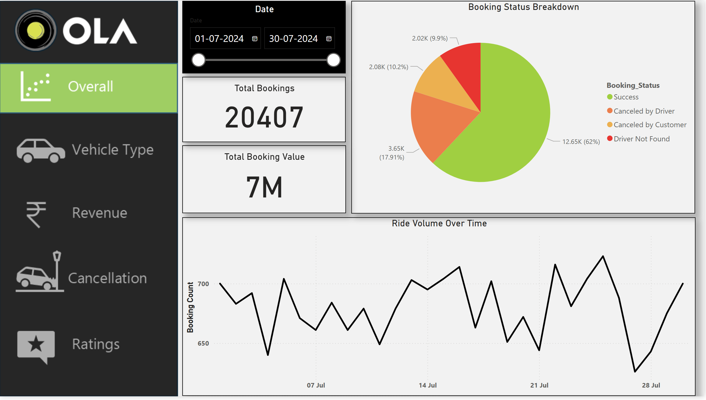
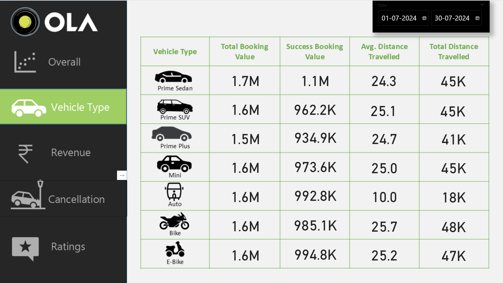
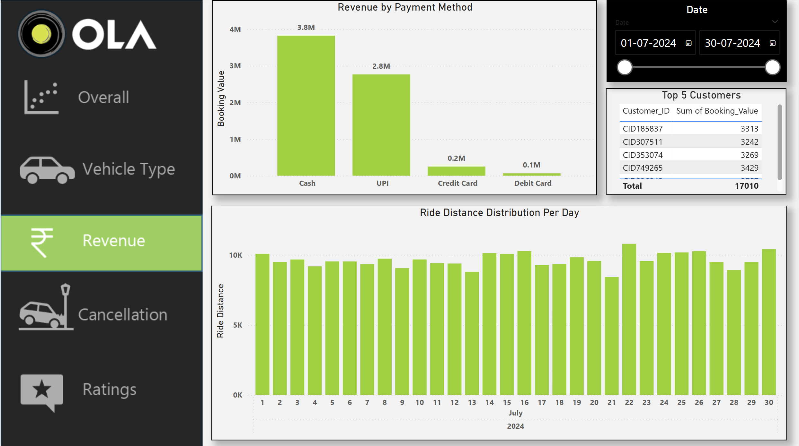
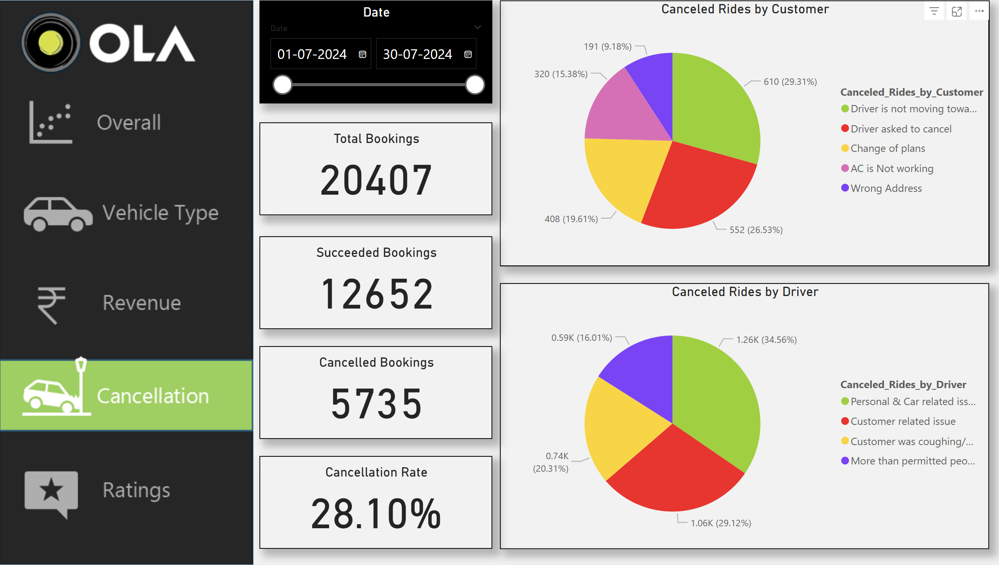
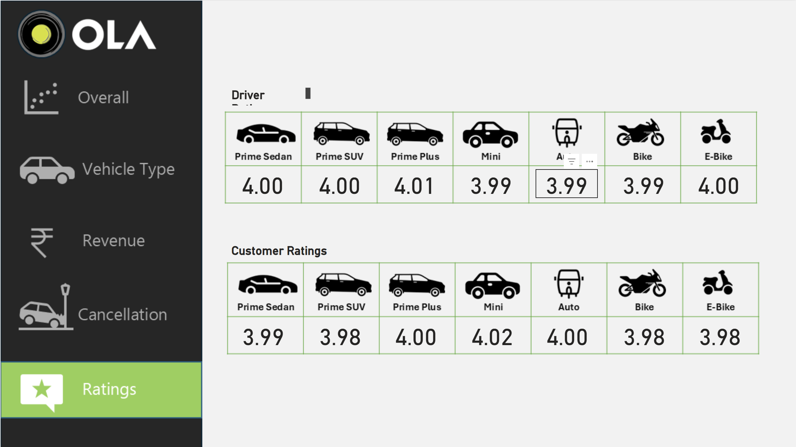

# 🚖 Ola Data Analysis and Visualization Project

This project is a complete data analysis and visualization case study for a ride-hailing service similar to Ola. The goal was to analyze ride data, extract insights, and build an interactive dashboard for stakeholders using real-world tools.

---

## 📁 Project Overview

- 🔢 **Dataset**: 20,000+ rows of ride data in Excel and CSV format
- 🛠️ **Tools Used**:  
  - **Excel** (Data cleaning & formatting)  
  - **MySQL** (Data querying and transformation)  
  - **Power BI** (Interactive dashboard & visualizations)  

---

## 🎯 Objectives

- Clean and transform raw ride data
- Analyze key business metrics like trip volume, revenue, user types, and cancellations
- Visualize actionable insights using interactive Power BI dashboards
- Answer business questions provided in the analysis prompt PDF

---

## 🗂️ Folder Structure

📁 Ola-Data-Analysis-and-Visualization-Project
├── 📄 ride_data.csv
├── 📄 ride_data.xlsx
├── 📄 queries.sql
├── 📄 ola_dashboard.pbix
├── 📁 Screenshots/
│ ├── page1.png
│ ├── page2.png
│ ├── page3.png
│ ├── page4.png
│ └── page5.png
├── 📄 analysis_questions.pdf
└── 📄 README.md
---

## 🧮 SQL Analysis

The SQL file contains queries used to:
- Aggregate total trips by city and customer type
- Calculate average revenue per ride
- Identify peak booking times
- Analyze cancellation trends

---

## 📊 Power BI Dashboard Screenshots

### 🔹 Page 1 – Overall Summary

### 🔹 Page 2 – City-wise Ride Insights

### 🔹 Page 3 – Revenue & Payment Types

### 🔹 Page 4 – Cancellation Trends

### 🔹 Page 5 – Customer Segmentation

> 📝 *You can open the `.pbix` file using Power BI Desktop to explore the interactive version.*

---

## 📌 Key Insights

- Highest number of trips originate from Urban cities
- Majority of users prefer online payment methods
- Afternoon time slots show highest trip activity
- Business users tend to cancel more trips than personal users

---

## 📄 PDF: Analysis Requirements

You can view the questions and business objectives from the original prompt here:  
👉 [Objective and Requirements.pdf](Objective and Requirements.pdf)

---

## 🙋‍♂️ About Me

Hi, I'm **Ishwar Verma** – a Final Year BTech student passionate about product analytics and business intelligence. This project is a part of my learning journey toward becoming a Product/Business Analyst.

---

## 📬 Contact

📧 Email: [ishwarverma8989@gmail.com]  
🔗 LinkedIn: [linkedin.com/in/ishwar-verrma](www.linkedin.com/in/ishwar-verrma)  
📂 Portfolio: *Coming Soon*

---

> ⭐ If you found this project interesting, consider giving it a star!
